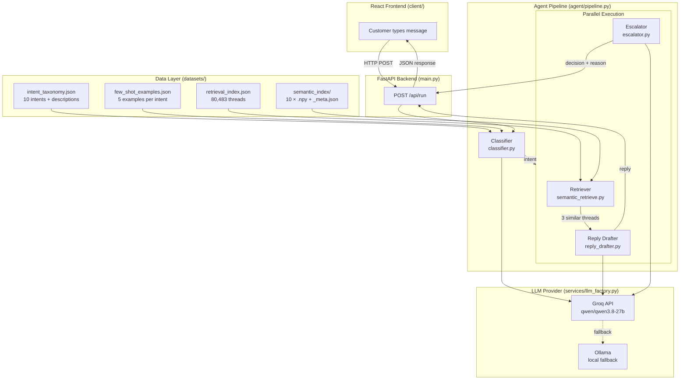

# 🍎 Apple Support Twitter AI Agent

> 📄 **Project Documents**: Read the full **[AI Customer Support Report](./AI%20Customer%20Support%20Report.pdf)** and the **[Decision Log](./Decision%20Log.md)**

<!-- > **Live Demo**: [https://your-deployment-url.com](https://your-deployment-url.com) ← replace with your deployed link -->


---

## Table of Contents

1. [Problem Statement](#1-problem-statement)
2. [What We Built](#2-what-we-built)
3. [Why Keywords Failed — The Path to Clustering](#3-why-keywords-failed--the-path-to-clustering)
4. [Intent Discovery Pipeline](#4-intent-discovery-pipeline)
   - [Why all-mpnet-base-v2](#why-all-mpnet-base-v2)
   - [Why UMAP](#why-umap)
   - [Why HDBSCAN](#why-hdbscan)
5. [System Architecture](#5-system-architecture)
6. [Agent Components — Deep Dive](#6-agent-components--deep-dive)
   - [Classifier](#61-classifier)
   - [Retriever](#62-retriever)
   - [Reply Drafter](#63-reply-drafter)
   - [Escalator](#64-escalator)
7. [Evaluation](#7-evaluation)
8. [Results](#8-results)
9. [Project Structure](#9-project-structure)
10. [Reproduce Results in 15 Minutes](#10-reproduce-results-in-15-minutes)
11. [Configuration](#11-configuration)

---

## 1. Problem Statement

The [Customer Support Twitter dataset](https://www.kaggle.com/datasets/thoughtvector/customer-support-on-twitter) contains 2.8 million tweets from brand support accounts. We focus on **AppleSupport** — the highest-volume brand with 106k+ replies — collected during **October–November 2017**, immediately after the iOS 11 launch.

Apple Support's Twitter workflow is **single-turn**: a customer tweets a problem, Apple replies once with either a fix or a DM invitation. The challenge is to automate this workflow at scale:

- **Classify** the customer's intent from a raw informal tweet
- **Draft** a grounded reply that sounds like Apple Support — empathetic, specific, Twitter-length
- **Decide** whether to escalate to a human agent, with a stated reason

What makes this hard: tweets are informal, misspelled, emoji-heavy, and often ambiguous. "my phone is acting up 😡" and "iOS 11 is trash" are both complaints but need completely different replies.

---

## 2. What We Built

A four-component AI agent pipeline exposed via a FastAPI backend and a React frontend:

```
Customer tweet
      │
      ▼
┌─────────────┐
│  Classifier  │  → intent label (1 of 10)
└─────────────┘
      │
      ├──────────────────────────┐  (parallel)
      ▼                          ▼
┌─────────────┐          ┌─────────────┐
│  Retriever  │          │  Escalator  │
│  +  Drafter │          │             │
└─────────────┘          └─────────────┘
      │                          │
      └──────────┬───────────────┘
                 ▼
         Structured response
         {intent, reply, decision, reason}
```

**10 discovered intents** (not hand-crafted — derived from 80k messages via clustering):

| Intent | Description |
|---|---|
| `autocorrect_i_bug` | iOS 11 bug where "I" → "A?" or question mark box |
| `ios_update_general` | General slowness/crashes after iOS/macOS update |
| `battery_drain` | Battery draining fast, not charging, dying early |
| `wifi_bluetooth` | WiFi dropping, Bluetooth turning on by itself |
| `phone_freezing` | Phone frozen, black screen, won't turn on |
| `account_access` | Apple ID locked, iCloud issues, phishing emails |
| `device_hardware` | Physical damage — screen, keyboard, charger, Watch |
| `app_issue` | iMessage, App Store, Maps, Siri, Apple Music broken |
| `order_purchase` | iPhone X delivery, billing charges, refund requests |
| `general_inquiry` | Vague complaints, how-to questions, CS requests |

---

## 3. Why Keywords Failed — The Path to Clustering

Our first approach defined 7 intents manually and used keyword matching to sample the eval set and build the retrieval index.

**The problem**: keyword accuracy was only **57.9%** and the sampling was biased toward clear-cut messages. More critically, keywords completely missed `autocorrect_i_bug` — the second-largest category in the dataset (17.5% of traffic). Customers described the iOS 11 I→? bug using phrases like "question mark", "boxes", "letter I", and the Unicode variation selector `I️`. No keyword captured this.

The keyword override rate during manual labelling was **32.2%** — meaning keywords were wrong almost a third of the time.

This motivated moving to **unsupervised clustering**: let the 80,491 customer messages reveal their own natural groupings rather than imposing a structure upfront.

---

## 4. Intent Discovery Pipeline

```
80,491 threads
      │
      ▼
Extract first customer message
(first turn only — matches runtime classification conditions)
      │
      ▼
Filter non-English (langdetect) → 76,656 messages
      │
      ▼
Generate embeddings
sentence-transformers/all-mpnet-base-v2
76,656 × 768 float32 matrix
      │
      ▼
Dimensionality reduction
UMAP: 768 → 30 dimensions
(cosine metric, n_neighbors=30, min_dist=0.0)
      │
      ▼
Density clustering
HDBSCAN: min_cluster_size=100, min_samples=20
→ 106 raw clusters + 17,789 noise points
      │
      ▼
Human inspection of cluster reports
(centroid-closest examples + top words + Apple replies)
      │
      ▼
Merge/split by support workflow similarity
→ 10 final intents
```

### Why all-mpnet-base-v2

`sentence-transformers/all-mpnet-base-v2` produces **768-dimensional** semantic vectors. Unlike bag-of-words or TF-IDF, it captures meaning — "my phone dies fast" and "battery depletes rapidly overnight" end up close in vector space even though they share no words. This is critical for clustering support messages where customers describe the same problem in wildly different informal language.

We chose this over smaller models (`all-MiniLM-L6-v2`, 384 dims) because the extra capacity (768 vs 384 dims) captures more semantic nuance — important when distinguishing between fine-grained intents like `phone_freezing` vs `ios_update_general` vs `battery_drain`, which all involve "my phone is not working after the update."

### Why UMAP

HDBSCAN struggles in 768 dimensions. This is called the **curse of dimensionality** — in high-dimensional spaces, every point becomes roughly equidistant from every other point, making density-based clustering meaningless.

UMAP (Uniform Manifold Approximation and Projection) solves this by preserving **local neighborhood structure** while compressing to 30 dimensions where distances are meaningful again.

Key parameters:
- `n_neighbors=30` — considers 30 nearby points when learning local structure. Higher = more global structure preserved. 30 balances local and global for 76k points.
- `n_components=30` — output dimensions. We use 30 (not 2) because 2D loses too much information. 30D gives HDBSCAN rich structure to work with.
- `metric="cosine"` — correct for normalised sentence embeddings. Cosine distance measures angle between vectors, not magnitude — two messages about the same topic but different lengths map to similar directions.
- `min_dist=0.0` — packs nearby points as tightly as possible. Better for clustering (we want dense groups), not for visualisation.

### Why HDBSCAN

K-Means requires you to specify K (number of clusters) upfront. We do not know how many intents exist in the data — that is the whole point.

**HDBSCAN** (Hierarchical Density-Based Spatial Clustering of Applications with Noise):
- **Discovers K from the data** — finds clusters based on density, no K required
- **Handles noise** — marks points that do not fit any dense cluster as -1. These become `general_inquiry` automatically
- **Variable cluster sizes** — finds clusters of very different sizes (13,414 messages for autocorrect vs 1,170 for order_purchase), unlike K-Means which tends toward equal-sized clusters

Key parameters:
- `min_cluster_size=100` — minimum messages to form a cluster (~0.13% of data). Small enough to catch real but rare intents like `wifi_bluetooth`
- `min_samples=20` — controls conservativeness. Higher = fewer clusters, more noise. 20 found the right balance for our data density
- `cluster_selection_method="eom"` — Excess of Mass. Finds compact, well-separated clusters rather than a deep hierarchy

Result: **106 raw clusters** which we manually merged into **10 final intents** using one rule — two clusters belong to the same intent if Apple's troubleshooting reply would be identical.

---

## 5. System Architecture



---

## 6. Agent Components — Deep Dive

### 6.1 Classifier

**File**: `agent/classifier.py`  
**Input**: raw customer tweet  
**Output**: one of 10 intent name strings

**How it works**:

The classifier uses **chain-of-thought prompting** — instead of asking the LLM to jump straight to an intent name, it first reasons through the problem:

```
Step 1: Write ONE sentence identifying the primary problem.
Step 2: Write the intent name on the next line.
```

This forces the model to reason before deciding, which matters for ambiguous messages like "my phone is broken since the update" (is it `ios_update_general`, `phone_freezing`, or `battery_drain`?).

**The prompt** (built by `agent/prompts.py`) contains:
- Intent descriptions with explicit boundary rules (e.g. "if phone is FROZEN → `phone_freezing` even if an update caused it")
- 5 centroid-closest examples per intent (from clustering — the most representative real messages)
- The customer message

**Parsing**: the response parser takes the last non-empty line as the intent name, strips punctuation, validates against the known intent list. Falls back to `general_inquiry` if the response is unexpected.

**Model**: `qwen/qwen3.8-27b` via Groq (fast, low cost for classification)

---

### 6.2 Retriever

**Files**: `agent/retriever.py` (keyword fallback), `agent/semantic_retrieve.py` (primary)  
**Input**: customer message + classified intent  
**Output**: 3 most similar historical Apple Support threads

**How it works** (semantic retrieval):

1. Embed the customer message using `all-mpnet-base-v2` → 768-dim query vector
2. Load `datasets/semantic_index/<intent>.npy` — the pre-built embedding matrix for that intent only
3. Compute cosine similarity: `similarities = intent_embeddings @ query_vector` (dot product on unit vectors)
4. Return top 3 by similarity score with their brand replies

**Why per-intent matrices instead of one big matrix**:
- At runtime we know the intent before searching
- Loading 4,077 battery_drain embeddings (~12MB) is 19x faster than loading all 76k (~225MB)
- No irrelevant cross-intent noise in similarity scores

**Why semantic over keyword retrieval**:
Keyword retrieval misses paraphrases — "phone dies fast" scores zero overlap with "battery depletes rapidly overnight." The semantic retriever finds these as 0.63 cosine similarity. Tested similarity scores: `autocorrect_i_bug` 0.90+, `app_issue` (iMessage) 0.78+.

---

### 6.3 Reply Drafter

**File**: `agent/reply_drafter.py`  
**Input**: customer message + intent + 3 retrieved threads  
**Output**: 2-3 sentence Twitter reply

**How it works**:

The drafter receives the 3 retrieved threads as grounding examples — real Apple Support replies to similar problems. The prompt instructs the LLM to:
- Match Apple's tone (empathetic, professional, not robotic)
- Stay within Twitter's length constraints
- Be specific to the classified intent
- End with a clear next step (DM for details, try this setting, etc.)

**Grounding is key**: without retrieval, the LLM drafts generic "sorry to hear that, please DM us" replies. With 3 semantically similar threads showing how Apple actually handled the same problem, the drafter can produce specific, actionable guidance.

**Model**: `qwen/qwen3.8-27b` via Groq (same model, reply quality judged by LLM-as-judge)

---

### 6.4 Escalator

**File**: `agent/escalator.py`  
**Input**: customer message + intent  
**Output**: `{decision: AUTO_HANDLE | ESCALATE, reason: str, confidence: float}`

**Two-layer architecture**:

**Layer 1 — Hard regex triggers (instant, no API call)**

Uses `re.search(r'\b' + pattern + r'\b')` with word boundaries to prevent substring false positives (e.g. `"sue"` matching inside `"issue"`).

Three trigger categories:
- `legal_threat` — "lawyer", "lawsuit", "sue", "legal action", "court"
- `safety_issue` — "exploded", "fire", "burn", "electric shock", "smoke"
- `crisis_language` — "kill myself", "end my life", "self harm"

If any trigger matches → escalate immediately, no API call, reason logged.

**Layer 2 — LLM judgment for ambiguous cases**

Everything else goes to the LLM with a structured prompt asking it to consider:
- Prior troubleshooting attempts mentioned
- Emotional intensity beyond frustration
- Complexity requiring human judgment
- VIP or enterprise account signals

Returns `AUTO_HANDLE` or `ESCALATE` with explicit reason and confidence score (0.0–1.0).

**Why two layers**: Hard rules are free, instant, and 100% reliable for clear-cut cases. The LLM handles the grey areas. This also makes the escalation logic explainable — the hard rules can be audited and updated without retraining anything.

**Current escalation rate**: 9.5% (23/242 evaluated messages)

---

## 7. Evaluation

### Golden Evaluation Set

**242 hand-labelled examples** across 10 intents (~24 per intent, stratified).

Sampled from the clustered corpus, independently human-verified. The `cluster_hint` column shows what the algorithm suggested — the human labeller overrode it 26.4% of the time, confirming the labels are genuinely independent ground truth.

See `Golden evaluation set/readme.md` for full sampling and labelling methodology.

### LLM-as-Judge

Reply quality scored on 4 dimensions (1–5 scale):
- **Relevance** — does the reply address the specific problem?
- **Tone** — does it sound like Apple Support?
- **Actionability** — does it give a clear next step?
- **Conciseness** — is it appropriately brief for Twitter?

Human-judge agreement validated on 30 randomly sampled replies:

| Dimension | Pearson Correlation | Within 1 Point |
|---|---|---|
| Conciseness | ~1.00 | 30/30 (100%) |
| Tone | 0.695 | 30/30 (100%) |
| Actionability | 0.735 | 29/30 (97%) |
| Relevance | 0.721 | 20/30 (67%) |
| Overall | 0.687 | 30/30 (100%) |

### ML Baselines

Two ML baselines trained on the 76,656 cluster-labelled messages, tested on the 242 human-labelled examples:

```bash
python3 -m evaluation_harness.classical_ml_baseline
```

---

## 8. Results

| System | Accuracy |
|---|---|
| Random (always predict `app_issue`) | ~14% |
| Keyword matching (trivial baseline) | 57.9% |
| ComplementNB — 76k cluster labels | 65.7% |
| Logistic Regression — 76k cluster labels | 69.8% |
| **LLM agent (this system)** | **82.2%** |

**Per-intent accuracy** (242 examples):

| Intent | Correct | Accuracy |
|---|---|---|
| phone\_freezing | 17/17 | 100.0% |
| autocorrect\_i\_bug | 24/25 | 96.0% |
| wifi\_bluetooth | 20/21 | 95.2% |
| app\_issue | 30/33 | 90.9% |
| device\_hardware | 14/16 | 87.5% |
| battery\_drain | 22/26 | 84.6% |
| general\_inquiry | 15/19 | 78.9% |
| order\_purchase | 23/30 | 76.7% |
| account\_access | 16/23 | 69.6% |
| ios\_update\_general | 18/32 | 56.2% |

**Reply quality** (LLM-as-judge, n=135):

| Dimension | Score |
|---|---|
| Conciseness | 5.00 / 5 |
| Tone | 4.90 / 5 |
| Actionability | 4.35 / 5 |
| Relevance | 4.31 / 5 |
| **Overall** | **4.56 / 5** |

**Escalation rate**: 9.5% (23/242)

---

## 9. Project Structure

```
.
├── EDA/                          # Intent discovery pipeline (run once)
│   ├── 00_thread_reconstruction.py   # Raw CSV → 80,491 threads
│   ├── 01_extract_messages.py        # Threads → 76,656 customer messages
│   ├── 02_embed.py                   # Messages → 768-dim embeddings
│   ├── 03_cluster.py                 # UMAP + HDBSCAN → 106 clusters
│   ├── 04_inspect.py                 # Cluster report for human review
│   ├── 05_build_taxonomy.py          # Clusters → taxonomy + retrieval index
│   ├── 06_build_semantic_index.py    # Embeddings → per-intent .npy files
│   └── data/                         # All EDA intermediate outputs
│
├── agent/                        # The four agent components
│   ├── pipeline.py               # Orchestrator — calls all four in order
│   ├── classifier.py             # Intent classification (chain-of-thought)
│   ├── prompts.py                # All LLM prompts in one place
│   ├── retriever.py              # Keyword fallback retrieval
│   ├── semantic_retrieve.py      # Semantic RAG retrieval (primary)
│   ├── reply_drafter.py          # Reply generation (grounded)
│   └── escalator.py              # Two-layer escalation decision
│
├── services/
│   └── llm_factory.py            # Swappable LLM provider (Groq / Ollama)
│
├── evaluation_harness/           # Full evaluation suite
│   ├── automated_metrics.py      # Main eval harness (242 examples)
│   ├── classical_ml_baseline.py  # TF-IDF + LR/NB baselines
│   ├── llm_as_judge.py           # Reply quality scoring + human agreement
│   └── README.md                 # How to run each evaluation step
│
├── datasets/                     # Active data files read by the agent
│   ├── apple_threads.json        # 80,491 reconstructed threads
│   ├── intent_taxonomy.json      # 10 intents with descriptions + keywords
│   ├── few_shot_examples.json    # 5 centroid examples per intent
│   ├── retrieval_index.json      # 80,483 threads indexed by intent
│   ├── eval_set_labelled.csv     # 242 human-labelled eval examples
│   └── semantic_index/           # Per-intent embedding matrices
│       ├── battery_drain.npy     # 4,077 × 768 float32
│       ├── battery_drain_meta.json
│       └── ...                   # One pair per intent
│
├── Golden evaluation set/
│   ├── eval_set_labelled.csv     # Copy of the golden eval set
│   └── readme.md                 # Sampling and labelling methodology
│
├── docs/
│   └── Decision Log.md           # 15 non-obvious decisions and why
│
├── client/                       # React frontend
│   ├── src/App.jsx               # Single-page UI
│   └── dist/                     # Pre-built, served by FastAPI
│
├── outputs/                      # Evaluation results
│   ├── eval_results.json         # Full per-example results
│   ├── eval_summary.json         # Accuracy, quality scores, escalation rate
│   ├── ml_baseline_results.json  # ML baseline numbers
│   └── human_scoring_sample.csv  # 30 human-scored replies for judge calibration
│
├── scripts/
│   ├── setup.sh                  # One-command project setup
│   └── generate_data.sh          # Full EDA pipeline (only if regenerating)
│
├── main.py                       # FastAPI server entry point
├── pyproject.toml                # Python dependencies (managed by uv)
└── .env.example                  # Environment variable template
```

---

## 10. Reproduce Results

> **Important**: The semantic embeddings and retrieval indexes (~250MB) are too large for standard GitHub tracking. After cloning, you **must** run the data generation script to build the agent's knowledge base before starting the backend.

### Prerequisites

- Python 3.14+
- Node.js 18+ and npm
- [`uv`](https://docs.astral.sh/uv/) (fast Python package manager)
- A [Groq API key](https://console.groq.com) (free tier works)

---

### Step 1 — Clone and set up

```bash
git clone https://github.com/Pradeesh1108/hiver-sde-intern-take-home-assignment.git
cd hiver-task
./scripts/setup.sh
```

This script:
1. Installs `uv` if missing
2. Creates a virtual environment and installs all Python dependencies via `uv sync`
3. Runs `npm install && npm run build` to build the React frontend
4. Creates `.env` from `.env.example` if it does not exist

---

### Step 2 — Add your API key

Open `.env` and set your Groq API key:

```env
GROQ_API_KEY=your_actual_key_here
LLM_PROVIDER=groq
```

To use a local model instead (no API key needed):

```env
LLM_PROVIDER=ollama
OLLAMA_MODEL=llama3.2:latest
OLLAMA_BASE_URL=localhost:11434
```

---

### Step 3 — Activate the virtual environment

```bash
source .venv/bin/activate
```

---

### Step 4 — Build the Knowledge Base (EDA)

Because the semantic indexes are large, they are built locally. You have two options:

#### Option 1: Fast Generation (Skipping Kaggle Download)

We provide the pre-processed `apple_threads.json` (78MB) in the repo. You can skip the raw Kaggle dataset download and build the index directly:

```bash
./scripts/generate_data_fast.sh
```

#### Option 2: Full Generation from Kaggle CSV

If you want to rebuild completely from scratch starting from the raw 2.8 million tweets dataset:

**First**, download the raw dataset from [Kaggle](https://www.kaggle.com/datasets/thoughtvector/customer-support-on-twitter) and place it at:

```
datasets/Customer Support Twitter Archive/twcs/twcs.csv
```

Then run:

```bash
./scripts/generate_data.sh
```

*Note: The embedding generation step takes **45–90 minutes on CPU** (or 8–12 minutes on Apple Silicon / GPU). All other steps are fast.*

---

### Step 5 — Start the server

```bash
uvicorn main:app --reload
```

Open [http://localhost:8000](http://localhost:8000) in your browser. The React frontend is served automatically.

---

### Step 6 — Reproduce headline results

Run the full evaluation harness on all 242 labelled examples:

```bash
python3 -m evaluation_harness.automated_metrics
```

Results are saved to `outputs/eval_summary.json`. Expected output:

```
Classification accuracy:  82.2%  (199/242)
Reply quality overall:    4.56 / 5
Escalation rate:          9.5%
```

Run the ML baselines for comparison:

```bash
python3 -m evaluation_harness.classical_ml_baseline
```

---

## 11. Configuration

All configuration is in `.env`:

| Variable | Default | Description |
|---|---|---|
| `GROQ_API_KEY` | — | Required if `LLM_PROVIDER=groq` |
| `LLM_PROVIDER` | `groq` | `groq` or `ollama` |
| `OLLAMA_MODEL` | `llama3.2:latest` | Model name for Ollama |
| `OLLAMA_BASE_URL` | `localhost:11434` | Ollama server URL |
| `MAX_WORKERS` | `4` | Parallel workers for batch eval |

**Switching providers**: the `services/llm_factory.py` file handles both Groq and Ollama through a unified `generate_completion()` interface. Changing `LLM_PROVIDER` in `.env` is all that is required — no code changes.

---

*Dataset: 80,491 AppleSupport threads · October–November 2017 · Embedding: all-mpnet-base-v2 · Clustering: UMAP + HDBSCAN · Eval: 242 hand-labelled examples · LLM: Groq qwen/qwen3.8-27b*